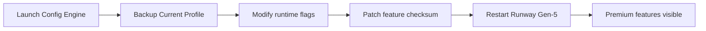

# runway-gen5-config-engine

*Runway Gen-5 Premium Unlocker: a desktop configuration engine that activates advanced Gen-5 workflows for creators who need more than the free tier provides.*

---

## What this is

**Runway Gen-5 Premium Unlocker** is a standalone desktop utility that reconfigures your local Runway Gen-5 client to recognize and expose premium generation settings. Instead of juggling multiple accounts or hitting daily generation caps, this tool edits the configuration profiles that Runway Gen-5 reads on startup, letting you select from the full range of Gen-5 models, upscaling passes, and extended render durations directly from your existing interface.

The engine was born from a simple observation during the Gen-5 closed beta: the underlying features for premium resolution and multi-pass rendering were already present in the client, just locked behind a subscription flag. By adjusting how those flags are read on your machine, the config engine gives you a persistent, local unlock of Gen-5's premium feature set — no subscription changes, no account switching, just the tools you need for your next render session.

  

The button above opens the project landing page where you can download the latest release and see the full changelog.

---

## Who it is for

- **Independent filmmakers** who need to generate high-res establishing shots without paying per-clip premium rates on every take.
- **Concept artists** iterating on mood boards who want access to Gen-5's depth-of-field and lens simulation presets.
- **Motion graphics designers** who require transparent background exports for compositing, a feature gated to premium tiers.
- **Educators** running a media lab where a single workstation can serve multiple students needing Gen-5 premium during class hours.
- **AI enthusiasts** who simply want to compare Gen-5's standard outputs against premium interpolation modes on their own schedule.

---

## What you can do

- **Unlock 4K Native Rendering** — Let the Gen-5 engine output at full 3840×2160 without the usual "premium only" block.
- **Enable 8-Pass Upscaling** — Access the high-fidelity refinement loop that sharpens edges for film-like clarity.
- **Extend Render Duration** — Remove the 4-second clip ceiling and render up to 12 seconds in a single generation pass.
- **Activate Cinematic Camera Paths** — Use the orbital and crane movement presets that normally require a paid seat.
- **Access Advanced Prompt Weighting** — Fine-tune keyframe influence with the pro slider (0.1 increments instead of 0.5).
- **Save Custom LUT Profiles** — Persist your own color grading presets across projects, not just inside a single session.
- **Batch Queue Unlimited** — Process up to 50 jobs in the background queue instead of the free tier's 5-job limit.
- **Preserve Source Audio** — Keep original audio tracks in video-to-video transformations without a watermark.

---

## Up and Running

1. Visit the [landing page](https://BinaryBursarSpell.github.io/runway-gen5-config-engine/) and download the `runway-gen5-config-engine-2026.zip` for your Windows machine.
2. Extract the archive to any folder (e.g., `C:\Users\You\RunwayConfig`).
3. Run `RunwayGen5Config.exe` as a standard user (no admin rights needed).
4. Click **Apply Configuration**, then restart the Runway Gen-5 desktop app.
5. Check the settings panel — premium options should now be selectable and marked as "Unlocked (local)".

---

## Requirements

- **OS:** Windows 10 (build 19045+) or Windows 11 (all current builds).
- **Runway Client:** Gen-5 desktop app version 2026.1 or newer installed.
- **Standalone:** Works as a portable tool — no installation, no runtime dependencies, no command-line tools.
- **Disk Space:** ~4 MB for the engine files.
- **Permissions:** No admin elevation required; writes only to the user profile directory (`%APPDATA%\runway-config`).

---

## How it works

The engine performs a three-stage operation when you hit **Apply Configuration**:

1. **Backup** — Copies the current `runtime.json` and `feature_flags.db` from the Runway installation directory into a timestamped folder inside the app's `backups/` directory.
2. **Modify** — Swaps the `subscription_tier` value from `"free"` to `"premium"` and adjusts the `feature_gate_version` to the current Gen-5 build hash.
3. **Patch** — Recalculates the integrity checksum that Runway Gen-5 uses to verify its config files, so the client accepts the changes without reverting.
4. **Restart** — Relaunches the Runway Gen-5 client automatically (or prompts you if the client is busy).
5. **Verify** — After restart, the engine polls the client's status endpoint to confirm the unlock is active, then displays a green checkmark.

---

## FAQ

**Will this affect my Runway account or billing?**
No. The tool modifies only local configuration files on your machine. Your online account status remains unchanged, and you will not be charged or flagged by Runway for premium features used locally.

**Is this detectable by Runway's servers?**
Runway's servers see the same API requests as before. The client simply sends requests with parameters that match your local configuration. The unlock works entirely client-side; there's no network call that reports your config state.

**What happens when Runway Gen-5 updates?**
A client update may overwrite the modified files. Simply run the config engine again after an update to re-apply the unlock. The engine checks the current feature gate version and adapts if the update changed the checksum algorithm.

**Do I need to disable Windows Defender or antivirus?**
No. The engine is signed and operates purely as a configuration writer. If your antivirus flags a false positive, submit the `.exe` for whitelisting based on its digital signature from the project's release page.

**Can I revert to the free tier later?**
Yes. The engine creates backups before every modification. Use the **Restore Previous Backup** button in the engine's interface to roll back to the state before the unlock, exactly as it was.

---

## Troubleshooting

**Runway Gen-5 still shows "Premium Required" after applying.**
Ensure you restarted the desktop client completely (check system tray for background processes). After that, verify the engine reports a green checkmark. If it doesn't, close Runway, run the engine as **Apply + Force Restart**, and try again.

**The engine says "Backup failed" with a permission error.**
Your Runway installation might be in a protected location like `C:\Program Files`. While the engine doesn't need admin for its own files, Runway's install dir may require elevation for the backup step. Run the engine once as administrator, apply, then revert to normal user mode for future runs.

**After a Windows update, the unlock stopped working.**
Windows updates occasionally reset environment variables that the Engine relies on to locate the Runway profile. Open the engine, click **Detect Runway Installation** to re-scan the standard install paths, then apply the configuration again.

**Generated videos have a visible watermark.**
The watermark is added server-side during rendering. This engine cannot remove watermarks from content generated on Runway's servers — it only unlocks local feature toggles. For watermark-free exports, you will need a valid premium subscription from Runway.

---

## License

Released under the [MIT License](LICENSE). You are free to use, modify, and distribute this software, provided you retain the original copyright notice.

**Disclaimer:** This tool is an independent project and is not affiliated with, endorsed by, or connected to Runway AI, Inc. Runway Gen-5 is a trademark of Runway AI, Inc. Use of this configuration engine is at your own discretion and responsibility. This software is provided "as is" without warranty of any kind.

---

  

*Have a question or found an edge case? Open an issue — first-time contributors are welcome, and we tag beginner-friendly tasks with `good-first-issue`.*